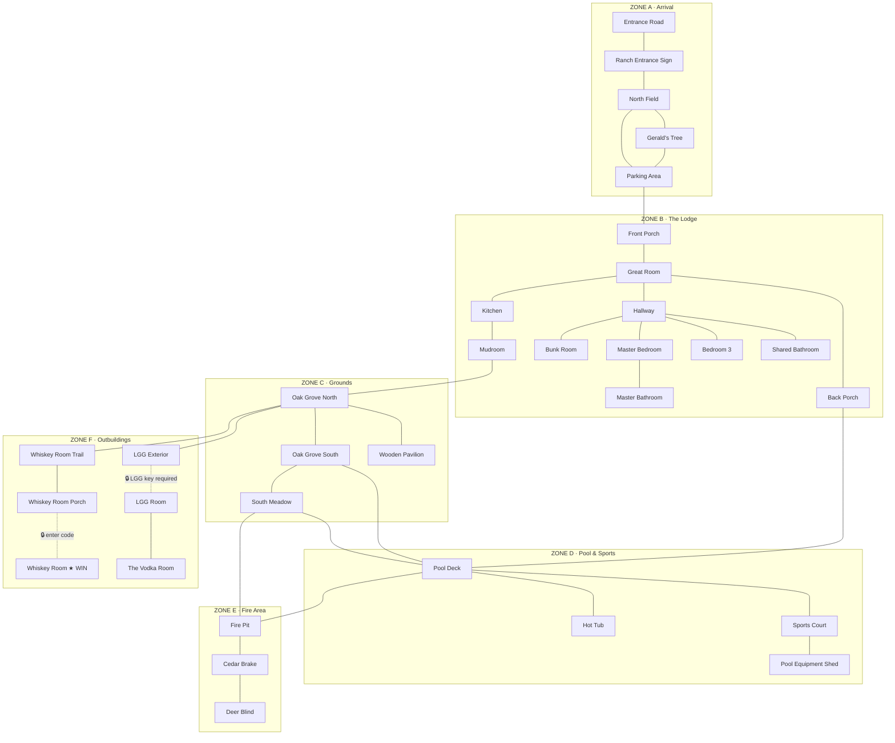

# lbpquest-iv: Oakridge Ranch — Game Plan

**Setting:** Oakridge Ranch, Johnson City, Texas  
**Engine:** TypeScript, lbpquest-ii architecture  
**Deployment:** GitHub Pages (static)  
**Tradition:** Zork/Enchanter-style text adventure, lbpquest series  

---

## Narrative Premise

You have just arrived at Oakridge Ranch for an LBP weekend. Your friends got here yesterday. The last text you received said they were "in the back somewhere." The driveway is empty. The Lodge is unlocked but quiet. You have 33 rooms to explore before you find them.

Unlike previous lbpquests, Oakridge has a **wandering antagonist** (Gerald the turkey, Zork's thief analog) and a **darkness mechanic** (something low and fast in the cedar brake, Zork's grue analog). Neither is punishing by default — the tone is comedic and exploratory — but darkness blocks progress and Gerald actively interferes with your inventory.

The **win condition** is reaching The Whiskey Room, the locked whiskey cabin at the end of the string-light trail. Your friends moved there from the Vodka Room sometime during the night — a note tells you as much, but first you have to find the note.

---

## Location Count

| Game | Navigable Rooms |
|------|----------------|
| lbpquest | ~16 |
| lbpquest-ii | 32 |
| **lbpquest-iv** | **33** |

---

## Physical Map



> Dashed lines (🔒) = locked door (LGG key required) or keypad entry (4-digit code). LGG key is hidden at Gerald's Tree under the empty beer can. Code digits are scattered around the ranch; code order is found in The Vodka Room.  
> Dark outdoor locations (Fire Pit, Cedar Brake, Deer Blind, Whiskey Room Trail) require the flashlight after dark.

---

## Location Reference

### Zone A: Arrival

**1. Entrance Road**  
The gravel road narrows past the gate. Flat Texas Hill Country in every direction. The drive curves north into the oaks.  
*Exits: N → Ranch Entrance Sign*  
*Notes: Start location. Gerald may appear here early.*

---

**2. Ranch Entrance Sign**  
A circular black sign on cedar posts: OAKRIDGE RANCH / Johnson City, Texas. An elk silhouette, two stars. The Lodge is visible at the end of the gravel road ahead.  
*Exits: S → Entrance Road | N → North Field*  
*Notable: Gerald roosts here in the evenings. If he steals the LGG key, it ends up here.*

---

**3. North Field**  
The open grassy approach between the sign and the Lodge. Late afternoon heat. Grasshoppers. The Lodge's green metal roof catches the light.  
*Exits: S → Ranch Entrance Sign | E → Gerald's Tree | N → Parking Area*

---

**4. Gerald's Tree**  
A massive gnarled live oak at the edge of the field, claimed entirely by Gerald. Claw marks on the bark — seven notches on the east face, three on the south. One (1) empty beer can on the ground beneath it (Lone Star). Examining the can reveals the LGG key hidden in the soil beneath it.  
*Exits: W → North Field | NW → Parking Area*  
*Notable: Gerald's home base. LGG key hidden here. Stolen items (including the Order Note) eventually found here.*

---

**5. Parking Area**  
The gravel loop in front of the Lodge. A security camera on a cedar post. The Lodge's front face — dark green corrugated steel, a deep covered porch — is immediately north. A gravel path curves east around the building.  
*Exits: S → North Field | W → Gerald's Tree | N → Front Porch*

---

### Zone B: The Lodge

**6. Front Porch**  
A wide covered porch across the full front of the Lodge. Cedar posts, wood ceiling. A welcome mat. Through the glass-paned front door the Great Room stretches back into the building.  
*Exits: S → Parking Area | E (door) → Great Room*

---

**7. Great Room**  
The heart of the Lodge. Cathedral ceiling of exposed steel trusses. A massive stone fireplace dominates the far wall. Above it: an enormous mounted whitetail buck with a twelve-point rack (Lord of the Oakridge Stags — see Mounted Lord, below). Two smaller deer heads flank it. A long farmhouse dining table seats fourteen. Couch cluster near the front. Open kitchen to the north. Hallway east. Back Porch south.  
*Exits: W → Front Porch | N → Kitchen | E → Hallway | S → Back Porch*  
*Notable: THE MOUNTED LORD resides here. See Puzzle: The Mounted Lord's Quest.*

---

**8. Kitchen**  
Modern kitchen in a barndominium. Butcher block island, stainless appliances, open shelving with mason jars. Hooks near the back door. A whiteboard on the fridge reads: *"Gerald got the last two beers. Check the whiskey room."*  
*Exits: S → Great Room | N → Mudroom*  
*Items: Flashlight (dead batteries, in drawer), Crackers (on counter)*

---

**9. Mudroom**  
Utilitarian back-of-kitchen room with a boot rack, coat hooks, and a washer/dryer. A back door leads outside to the north end of the Lodge. A single Lone Star tallboy sits on the dryer — the last one Gerald missed.  
*Exits: S → Kitchen | N → Oak Grove North*  
*Items: Lone Star (beer, drinkable, no game effect except flavor)*

---

**10. Hallway**  
A short paneled hallway off the Great Room. A framed print of a highland cow hangs on one wall — a full portrait, brown and shaggy, vaguely offended. On the opposite wall: a mounting bracket, the kind meant to hold a taxidermied bird or a rifle. It holds a lone stick. Just a stick. No explanation.  
*Exits: W → Great Room | N → Bunk Room | E → Master Bedroom | S → Bedroom 3*  
*Also: Shared Bathroom accessible from here*  
*Items: Lone Stick (examine only — "A lone mounting bracket. Whatever it held is gone. The bracket has not accepted this loss.")*

---

**11. Bunk Room**  
Three sets of bunk beds in a summer-camp arrangement. Cowboy-print throw blankets. A bedside table with a cactus-shaped nightlight. Above one upper bunk: a framed print of a longhorn steer looking approximately offended. Faint popcorn smell.  
*Exits: S → Hallway*  
*Items: Cactus Nightlight (examine → take batteries)*

---

**12. Master Bedroom**  
The nicest room. King bed, linen duvet. Four framed prints on the walls: two highland cows, one bluebonnet cluster, one abstract (creek? clouds?). In the corner: a medium-sized child's pop-up tent, fully assembled. Its presence is not explained.  
*Exits: W → Hallway | E → Master Bathroom*  
*Items: Child's Tent (examine → look inside → Stuffed Armadillo, Glow Stick, Note from G)*

---

**13. Master Bathroom**  
En-suite bathroom. Clean, modern. Walk-in shower with river rock floor. One hand towel hanging at an aggressive angle. A rubber duck on the edge of the tub. The rubber duck is wearing a tiny cowboy hat.  
*Exits: W → Master Bedroom*  
*Items: Rubber Duck (examine → "It stares at you with the confidence of something that has nothing to prove.")*

---

**14. Bedroom 3**  
A smaller bedroom, lavender walls, a queen bed. More botanical prints — a prickly pear, a yucca, something that might be a mountain laurel. A window looking into the oak grove. Through it, at the right moment, you can see two does standing in the grass.  
*Exits: N → Hallway*

---

**15. Shared Bathroom**  
A full bathroom off the hallway. Someone left a paperback western novel on the back of the toilet. The cover shows a cowboy silhouetted against a sunset and the title: *"No Quarter Given."* The bookmark is at page 12.  
*Exits: Hallway*  
*Items: Western Novel (examine only — "Page 12. He has not gotten past page 12.")*

---

**16. Back Porch**  
The back porch is the Lodge's best feature. A broad cedar-roofed pavilion extending from the rear of the building. A massive flatscreen TV is mounted flush to the cedar wall, currently showing a highway somewhere in the mountains. Outdoor sectional sofa, low fire table, two wooden rocking chairs. Against one post: a high-top bar built from the cross-section of an enormous live oak trunk, still rough on the edges. String lights run from the eaves out toward the pool deck.  
*Exits: N → Great Room | SE → Pool Deck*  
*Notable: Bar menu lists cocktails embedding all four code digits.*

---

### Zone C: The Grounds

**17. Oak Grove North**  
A cathedral of live oaks — gnarled, wide-canopied, ancient. String lights run between trunks and off toward the outbuildings in the trees. The grass is cool even in the afternoon heat. Concrete paths branch in multiple directions. Two does stand near the center. They look at you. One flicks an ear.  
*Exits: NE → Mudroom | S → Oak Grove South | E → Wooden Pavilion | W → Whiskey Room Trail | NW → LGG Exterior*  
*Notes: Gerald wanders here. Deer visible. String lights = safe after dark.*

---

**18. Oak Grove South**  
The southern portion of the grove, closer to the pool. The oak canopy thins and the sky opens up. Concrete paths lead east toward the pool deck. South, the grass becomes a wider meadow. The pool's color-changing lights are visible through the trees.  
*Exits: N → Oak Grove North | E → Pool Deck | S → South Meadow*

---

**19. Wooden Pavilion**  
A standalone open-sided wooden pavilion in the middle of the grove, separate from the Lodge. Picnic table, a propane lantern on a hook, a cooler (empty). It has the vague feeling of being the place where someone once gave a speech. Or a sermon. There are no chairs arranged to face anything in particular, but you feel like there should be.  
*Exits: W → Oak Grove North*  
*Items: Propane Lantern (examine → doesn't work, no fuel)*

---

**20. South Meadow**  
The open field south of the grove widens here. The cedar thicket is visible at the far southern edge. Two red patio umbrellas mark the fire pit clearing to the southeast. The pool deck loops around to the northeast. Two deer were just here — you can see their tracks — but they heard you coming.  
*Exits: N → Oak Grove South | SE → Fire Pit | NE → Pool Deck*

---

### Zone D: Pool & Sports

**21. Pool Deck**  
The pool is freeform and ridiculous in the best possible way. A mosaic-tile step rises from the center like a small island. An elevated circular hot tub at one end spills over via a cascade into the main pool. Limestone ledge walls with built-in waterfall features. Color-changing LED lights currently cycling violet → magenta → electric blue. A foam ring float tied to a tree. Pool loungers. Two red patio umbrellas.  
*Exits: W → Oak Grove South | N → Sports Court | E → Hot Tub | S → Fire Pit*  
*Notes: LED lights = safe after dark. Pool Ring Float visible as an item.*

---

**22. Hot Tub**  
The elevated circular hot tub is its own domain. Jets running. Purple-lit. It smells of chlorine and cedar. From here, looking back toward the Lodge, you can see the rocking chairs on the Back Porch through the trees. There is already a rubber ducky in the hot tub (a different one from the master bathroom). This one is not wearing a hat.  
*Exits: W → Pool Deck*  
*Items: Plain Rubber Duck (examine → "This one has nothing to prove either, but less charisma about it.")*

---

**23. Sports Court**  
A full pickleball court striped on a blue multi-sport surface, ringed in black netting with a basketball hoop at the far end. The court is lit by a tall floodlight pole. On the gate hook: a whiteboard scoreboard reading GERALD: 3 / HUMANS: 0.  
*Exits: S → Pool Deck | E → Pool Equipment Shed*  
*Items: Pickleball Paddle (sitting on net post, takeable but no puzzle use — Gerald ignores it, which says something about Gerald)*

---

**24. Pool Equipment Shed**  
A corrugated metal utility shed tucked against the fence line. Pump equipment, chemical jugs, a length of backwash hose. Also: a small shelf with a bottle of sunscreen, a lost pair of sunglasses (prescription), and a handwritten pool schedule taped to the wall listing "GERALD — UNSUPERVISED SWIM" at 2pm on Tuesdays.  
*Exits: W → Sports Court*  
*Items: Sunglasses (examine → "Someone needs these. Badly.")*

---

### Zone E: Fire Area

**25. Fire Pit**  
A wide ring of tamped earth in a clearing. Metal fire pit in the center — cold, with a stack of split cedar beside it. Four camp chairs: two folding nylon, two Adirondack. The trees are dense enough here that this spot feels properly isolated.  
This is where your friends were supposed to be. They are not here. There is one (1) empty Topo Chico bottle on an Adirondack armrest.  
At night: the moon is directly overhead. No other light. There are sounds from the cedar brake to the south.  
*Exits: N → Pool Deck | NW → South Meadow*  
*Notes: Requires flashlight at night. Darkness flavor text: "Something moves in the cedar brake. It is low to the ground and fast. You back away slowly."*

---

**26. Cedar Brake**  
The cedar thicket at the south end of the meadow. Dense, fragrant, dim even in daylight. Branches close in overhead. The ground is soft with decades of cedar duff. Something has been nesting here — the grass is pressed flat in an oval the right size for something you'd rather not think about.  
*Exits: N → Fire Pit | S → Deer Blind*  
*Notes: Always dark. Requires flashlight. Gerald sometimes retreats here when spooked.*

---

**27. Deer Blind**  
A small wooden hunting blind at the southern edge of the property, barely visible from the cedar brake. It smells of doe urine and old coffee. Inside: a folding stool, a rifle rest (rifle absent), a pair of binoculars, and a laminated sign taped to the interior wall that reads "PATIENCE IS A VIRTUE — ALSO BRING SNACKS."  
The binoculars, taken to the right location, can be used to spot something in the far field.  
*Exits: N → Cedar Brake*  
*Items: Binoculars (takeable — useable at Wooden Pavilion and Back Porch for flavor descriptions)*

---

### Zone F: The Outbuildings

**28. Whiskey Room Trail**  
A short path winds west through the oaks, following the string lights. Cedar mulch underfoot. The trees get closer together. String lights overhead. The path curves and a dark-stained wood cabin materializes out of the shadows.  
*Exits: E → Oak Grove North | W → Whiskey Room Porch*  
*Notes: Requires flashlight after dark.*

---

**29. Whiskey Room Porch**  
A small step and narrow covered stoop in front of the Whiskey Room cabin. A boot scraper. A mounted antler beside the door — two tines, modest, decorative. The door has a small numeric keypad (0–9) and a brass plaque engraved: COURT · SHED · TUB · BLIND.  
*Exits: E → Whiskey Room Trail | W (🔒 enter 4-digit code) → Whiskey Room*

---

**30. Whiskey Room ★ WIN**  
Dark inside, in a pleasant way. Knotty pine walls stained almost black. Four whitetail deer heads mounted above long dark shelving lined with Texas whiskey bottles — Garrison Brothers, Treaty Oak, one unopened fifth of Blanton's. The centerpiece: a long bar table built on two actual whiskey barrels, tops inlaid with Jack Daniel's medallions. A hammered copper sink. Loose antlers on a lower shelf. Antler chandelier with Edison bulbs overhead.

On the bar top: antler coasters, an empty whiskey glass, a broken mechanical bar jigger (brass, shiny).

Your friends are here. Someone is at the bar. Someone is in the corner chair with a whiskey. They look up when you come in.

*"There you are. We've been here for an hour. Grab a glass."*

**You win.**

*Exits: E → Whiskey Room Porch*  
*Items: Broken Jigger (brass, shiny — Gerald bait), Blanton's Bottle*

---

**31. LGG Exterior**  
The second outbuilding is stranger than the Whiskey Room. Corrugated metal sides, faded white. A cedar-framed open-air lean-to addition along the front, with string lights and a rough-cut bar shelf on the railing. Through a smudged window: a neon sign glows pink and green — LET'S GO GIRLS. A rooster weathervane on the peak turns slowly in a wind you cannot feel. On the door: *"SKIP'S SHACK — Members Only."*  
*Exits: SE → Oak Grove North | In (🔒 LGG key required) → LGG Room*  
*Notes: The neon sign provides enough light after dark — this location is safe without a flashlight. LGG key is NOT here — it's hidden at Gerald's Tree.*

---

**32. Let's Go Girls Room**  
Not what you expected. Green astroturf carpet. Three gilt-framed mirrors at staggered heights on one wall. A cowhide rug. Two white tufted ottoman poufs. A pair of deep green velvet chairs. Botanical art prints — ferns, wildflowers, a cactus silhouette. A half-empty bottle of rosé on a side table. The room smells like cedar and a very specific candle.  
On the back wall: a door, painted the same green as the velvet chairs, nearly invisible. The handle is a small antler tip.  
*Exits: Out → LGG Exterior | In (hidden door) → The Vodka Room*

---

**33. The Vodka Room**  
A small, dark anteroom. The only light is a neon sign: **THE VODKA ROOM**, cold purple-white. Wire industrial shelving stocked with flavored vodkas, mixers, and one extremely out-of-place bottle of Kahlúa. A purple fur rug. Two camp chairs, one knocked sideways.

Someone was here recently — empty glasses, a card game left mid-hand, the Kahlúa bottle moved to a chair with apparent deliberateness. On the side table: a folded cabin note in black marker. WENT TO THE CABIN. FOLLOW THE STRING LIGHTS. CODE ORDER: COURT · SHED · TUB · BLIND.

*Exits: S → LGG Room*  
*Items: Order Note (folded cabin note — reveals code digit order; Gerald will steal this)*

---

## Items

### Puzzle-Critical

| Item | Location Found | Purpose |
|------|---------------|---------|
| Flashlight | Kitchen (drawer) | Unlocks dark locations after dark; needs batteries |
| Batteries | Bunk Room (cactus nightlight) | Powers flashlight |
| LGG Key | Gerald's Tree (hidden under empty beer can) | Unlocks LGG Exterior door |
| Order Note | Vodka Room (side table, folded) | Reveals code digit order (COURT·SHED·TUB·BLIND); Gerald steals this |
| Crackers | Kitchen (counter) | Gerald distraction option 1 |
| Broken Jigger | Whiskey Room (bar top, brass) | Gerald distraction option 2 (shiny) |

### Flavor / Examine

| Item | Location | Description |
|------|----------|-------------|
| Child's Tent | Master Bedroom | Contains: stuffed armadillo, glow stick, note from "G" |
| Stuffed Armadillo | Inside child's tent | No game use. Just an armadillo. |
| Glow Stick (green) | Inside child's tent | Active. Provides dim light flavor only — not a substitute for flashlight. |
| Note ("THIS IS MY TENT — G") | Inside child's tent | Gerald's tent. It has always been Gerald's tent. |
| Lone Stick | Hallway | Mounted bracket holding just a stick. The bracket has not accepted this loss. |
| Cactus Nightlight | Bunk Room | Contains batteries — take batteries to get them |
| Western Novel | Shared Bathroom | Bookmarked at page 12. Has always been page 12. |
| Rubber Duck (cowboy hat) | Master Bathroom | Examine only. |
| Rubber Duck (plain) | Hot Tub | Examine → "2" on bottom (code digit for TUB). |
| Pool Schedule | Pool Equipment Shed | Lists "TUESDAY 7:00 PM — GERALD" — digit 7 (SHED) |
| Scoreboard Sign | Sports Court | GERALD: 3 / HUMANS: 0 — digit 3 (COURT) |
| Plain Rubber Duck | Hot Tub | "2" marked on bottom — digit 2 (TUB) |
| Order Note | Vodka Room / Gerald's Tree | Code order: COURT·SHED·TUB·BLIND → 3721 |
| Whiteboard Note | Kitchen (fridge) | "Gerald got the last two beers. Check the whiskey room." |
| Binoculars | Deer Blind | Takeable; reveals flavor descriptions from Pavilion and Back Porch |
| Empty Beer Can | Gerald's Tree | Lone Star. Gerald did this. |
| Blanton's Bottle | Whiskey Room (shelf) | Examine only. Unopened. Tempting. |
| Propane Lantern | Wooden Pavilion | Examine: doesn't work. No fuel. |
| Lone Antler | Whiskey Room Porch | Decorative. Examine only. |
| Topo Chico | Fire Pit | Empty. Someone was here. |

---

## Antagonists & Mechanics

### Gerald the Turkey (Wandering Antagonist)

Gerald is a wild tom turkey — large, iridescent, and fully convinced the property belongs to him. He wanders the Arrival zone and Oak Grove on a semi-random schedule.

**What Gerald does:**
- Blocks paths (you must wait or distract him to pass)
- Steals one item from inventory when you're not paying attention (any food item, any shiny object, or the Cabin Key if you're carrying it through Oak Grove North)
- Drops stolen items at Gerald's Tree eventually
- Contributes to the scoreboard (GERALD: 3 / HUMANS: 0)

**How to handle Gerald:**
- `give crackers to gerald` — he wanders off to eat them
- `show jigger to gerald` — he chases the shiny object, drops whatever he stole
- `ring bell` (if you've examined the scoreboard) — a joke command that plays a ding sound and Gerald briefly freezes, confused

**Gerald flavor text (rotating):**
- *"Gerald is standing in the middle of the path. He looks at you with one eye, then the other. He does not move. He makes a sound like a rusty gate."*
- *"Gerald has arrived and is now patrolling the parking area with the grim efficiency of a regional manager."*
- *"Gerald is not here. This is somehow more alarming."*
- *"Gerald appears to have eaten something. He seems satisfied. He does not explain."*
- *"Gerald is at Gerald's Tree. He is simply Gerald, being Gerald, in his place."*

**Gerald and the Order Note:** When the player first passes through Oak Grove North carrying the Order Note (picked up from the Vodka Room), Gerald intercepts and snatches it (flavor text: *"As you step back under the oaks, something crashes through the cedar at full speed. Gerald snatches the note off your person with his beak in a single practiced motion and is gone north before you finish the sentence you were starting to form."*). The note lands at Gerald's Tree (shown in the location description). This sequence is scripted — it happens once. Examining the note at Gerald's Tree still reveals the code order.

---

### Darkness / The Thing in the Cedar Brake

After the player has made a certain number of moves (TBD during implementation — probably 50 moves in), outdoor light-source status becomes relevant. The following locations become **dark after dark** unless the flashlight is active:

- Whiskey Room Trail  
- Whiskey Room Porch  
- Fire Pit  
- Cedar Brake  
- Deer Blind  
- South Meadow (partial)

Lit locations (always safe): Oak Grove North, Oak Grove South (string lights), Pool Deck (LED lights), Sports Court (floodlight), LGG Exterior (neon sign).

**In dark locations without flashlight:**
> *"It's too dark. You can't see enough to move safely. Something moves in the brush — low, quick, patient. You back away toward the lights."*  
Player is returned to the last lit location.

**With dead flashlight:**  
> *"The flashlight clicks. Nothing. You're going to need batteries first."*

The Thing is never described, encountered, or named. It exists only as the sound you hear when the flashlight fails. Its purpose is to make the flashlight puzzle feel consequential.

---

## The Mounted Lord (Optional Extended Quest)

The Great Room's central buck speaks to the player on first visit and again whenever they return. He tracks how many of the 33 locations the player has visited.

> *"Come ye to seek your companions? They are in the cabin at the end of the string lights, beyond the dark trail to the west. But the door is locked. The key is in the neon room — find it, and follow the lights."*

Once the Mounted Lord confirms the player has visited all 33 locations (an optional completionist goal), the win text in The Whiskey Room gets an extended variant:

> *(The deer heads in the Great Room turn, as one, and dip slightly as you walk past. You don't look back, but you feel it.)*

---

## Puzzle Flow (Main Path)

```
ARRIVE (Entrance Road)
    → explore Lodge → find FLASHLIGHT (kitchen)
    → explore Bunk Room → find BATTERIES (cactus nightlight)
    → combine: working flashlight
    → now explore after-dark areas
    → explore Gerald's Tree → EXAMINE BEER CAN → find LGG KEY (hidden in soil)
    → navigate to LGG Exterior → USE LGG KEY → enter LGG Room
    → find HIDDEN DOOR → The Vodka Room
    → find ORDER NOTE (side table): "WENT TO THE CABIN / CODE ORDER: COURT·SHED·TUB·BLIND"
    → head back through Oak Grove North
    → SCRIPTED: Gerald steals Order Note
    → gather four code digits from around the ranch:
        · Sports Court scoreboard: GERALD: 3 → digit 3 (COURT)
        · Pool Equipment Shed schedule: TUESDAY 7:00 PM → digit 7 (SHED)
        · Hot Tub rubber duck bottom: "2" → digit 2 (TUB)
        · Deer Blind door frame stencil: BLIND NO. 1 → digit 1 (BLIND)
    → code order: COURT(3) · SHED(7) · TUB(2) · BLIND(1) → 3721
    → (optional: examine Order Note at Gerald's Tree, or examine plaque at Whiskey Room Porch for order reminder)
    → follow Whiskey Room Trail → Whiskey Room Porch
    → ENTER 3721 → door opens → enter Whiskey Room
    → WIN
```

---

## Architecture & File Structure

Following lbpquest-ii conventions exactly.

```
lbpquest-iv/
├── PLAN.md
├── package.json
├── tsconfig.json
├── vite.config.ts          (or webpack — match lbpquest-ii)
├── public/
│   └── index.html
└── src/
    └── app/
        ├── GameEngine.ts
        ├── Startup.ts          (location wiring, item placement, neighbor maps)
        ├── locations/
        │   ├── BaseLocation.ts
        │   ├── LocationKey.ts  (enum of all 33 location IDs)
        │   ├── index.ts
        │   ├── EntranceRoad.ts
        │   ├── RanchEntranceSign.ts
        │   ├── NorthField.ts
        │   ├── GeraldTree.ts
        │   ├── ParkingArea.ts
        │   ├── FrontPorch.ts
        │   ├── GreatRoom.ts
        │   ├── Kitchen.ts
        │   ├── Mudroom.ts
        │   ├── Hallway.ts
        │   ├── BunkRoom.ts
        │   ├── MasterBedroom.ts
        │   ├── MasterBathroom.ts
        │   ├── BedroomThree.ts
        │   ├── SharedBathroom.ts
        │   ├── BackPorch.ts
        │   ├── OakGroveNorth.ts
        │   ├── OakGroveSouth.ts
        │   ├── WoodenPavilion.ts
        │   ├── SouthMeadow.ts
        │   ├── PoolDeck.ts
        │   ├── HotTub.ts
        │   ├── SportsCourt.ts
        │   ├── PoolEquipmentShed.ts
        │   ├── FirePit.ts
        │   ├── CedarBrake.ts
        │   ├── DeerBlind.ts
        │   ├── WhiskeyRoomTrail.ts
        │   ├── WhiskeyRoomPorch.ts
        │   ├── WhiskeyRoom.ts
        │   ├── LGGExterior.ts
        │   ├── LGGRoom.ts
        │   └── VodkaRoom.ts
        └── items/
            ├── BaseItem.ts
            ├── ItemKey.ts      (enum of all item IDs)
            ├── index.ts
            ├── Flashlight.ts
            ├── Batteries.ts
            ├── LGGKey.ts
            ├── Crackers.ts
            ├── BrokenJigger.ts
            ├── ChildTent.ts
            ├── GlowStick.ts
            ├── LoneStick.ts
            ├── Binoculars.ts
            └── [remaining flavor items]
```

### Implementation Order

1. **Scaffold** — copy lbpquest-ii package.json, tsconfig, vite config; install deps  
2. **Enums** — `LocationKey.ts` and `ItemKey.ts` with all IDs  
3. **BaseLocation / BaseItem** — copy from lbpquest-ii, adjust as needed  
4. **GameEngine** — copy from lbpquest-ii; add Gerald wandering logic and darkness state  
5. **Locations (Zone A first)** — wire Startup with neighbor maps as each zone completes  
6. **Items (puzzle-critical first)** — Flashlight, Batteries, LGG Key, Crackers, Jigger  
7. **Gerald logic** — wandering schedule, item theft, distraction handlers  
8. **Darkness logic** — move counter, location lit-status, flashlight state check  
9. **Mounted Lord** — Great Room and Whiskey Room special location classes  
10. **Remaining locations and flavor items** — room by room  
11. **Win condition** — WhiskeyRoom triggers end state  
12. **Deploy** — GitHub Pages via gh-pages or Actions  

---

## Open Questions (Decide During Implementation)

- Does Gerald use a timer (every N moves) or random chance (% per move) for appearances?
- Is the darkness mechanic a hard move counter or time-of-day driven (i.e., triggered after first entering the Whiskey Room, not by clock)?
- Does the Mounted Lord's completionist quest need to be tracked, or is the main-path win sufficient for v1?
- What build tool does lbpquest-ii use? Match it exactly for consistency.
